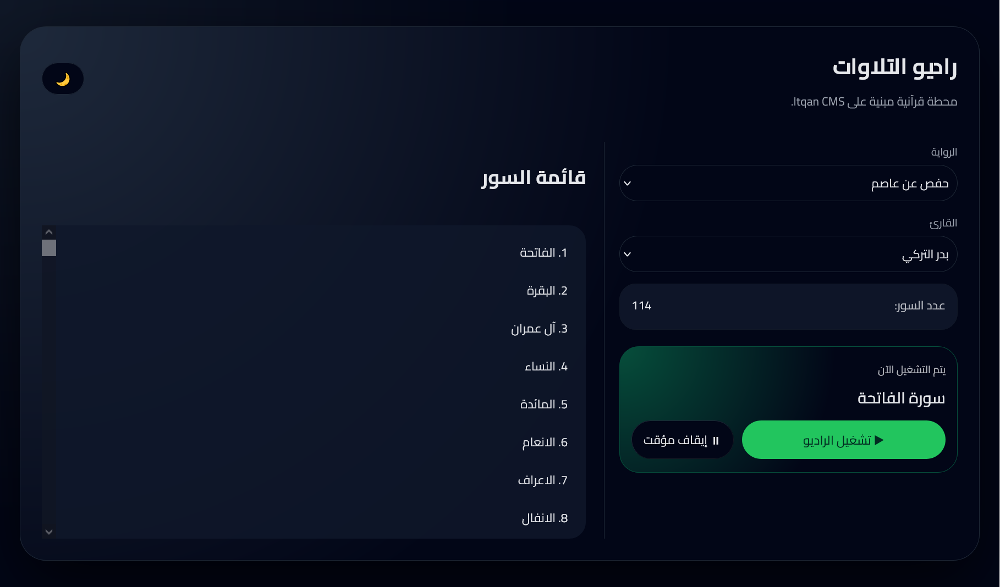
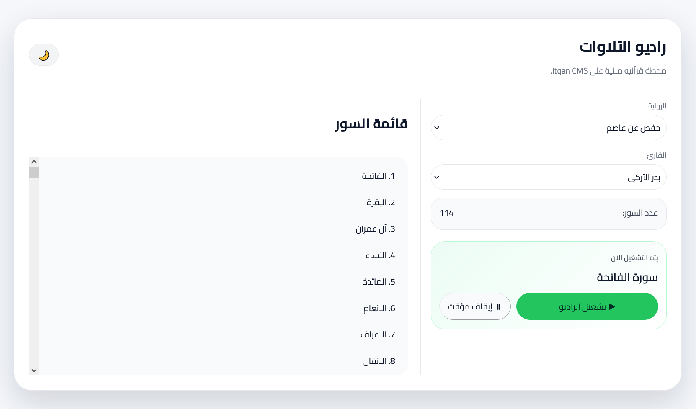

# تطبيق راديو التلاوات 

تطبيق راديو التلاوات هو تجربة تطبيقية تعليمية، تهدف إلى استكشاف إمكانيات الواجهة البرمجية  [Itqan Quranic CMS API](https://api.cms.itqan.dev/developers-api/docs) وبناء نماذج استخدام عملية لها.

تم تطوير المشروع كتطبييق ويب يقدم تجربة استماع قرآنية متتابعة (Radio / Playlist)، بواجهة حديثة مستوحاة من تطبيقات البث الصوتي، مع الحفاظ على بساطة الاستخدام والتصميم الموافق للمحتوى القرآني.

## فكرة التطبيق

يوفر التطبيق محطة استماع قرآنية تعمل تلقائيًا، حيث يقوم بـ:

- اختيار الرواية (حاليًا تتوفر تلاوات لرواية حفص)
- اختيار القارئ ((حاليًا يتوفر ست قرّاء)
- جلب جميع سور المصحف الخاصة بهذه التلاوة
- تشغيلها تلقائيًا من سورة الفاتحة حتى سورة الناس دون انقطاع

التجربة مصممة لتكون واضحة وسلسة، دون الحاجة لتدخل المستخدم بعد بدء التشغيل.

## الميزات

-  تشغيل تلقائي متسلسل لجميع السور
-  عرض اسم السورة ورقمها (مباشرة من الواجهة البرمجية)
-  دعم الوضع الداكن والفاتح
-  جلب كامل التلاوات 
-  كود بسيط وواضح (Vanilla JavaScript)


## الواجهة البرمجية المستخدمة

 الرابط الأساسي للواجهة البرمجية على النحو التالي:

```
https://api.cms.itqan.dev/developers-api
```

تبنى جميع الاستدعاءات اعتمادًا على هذا العنوان الأساسي، وأهم المسارات المستخدمة هي:

- الروايات

  ```
  GET /riwayahs/
  ```

- القرّاء

  ```
  GET /reciters/
  ```

- التلاوات 

  ```
  GET /recitations/
  ```

- معرفات المسارات الصوتية

  ```
  GET /recitations/{asset_id}/}
  ```


### طريقة جلب كامل التلاوات (معالجة Pagination)

تم تطبيق حل برمجي لجلب جميع الصفحات تلقائيًا، نظرًا لأن طلب المسار التالي:
```
GET /recitations/{asset_id}/
```
يعيد 100 عنصر فقط لكل صفحة.

فعند إرسال الطلب التالي على سبيل المثال:

```
https://api.cms.itqan.dev/developers-api/recitations/11/
```

ستعيد الواجهة أول 100 تلاوة للقارئ بدر التركي، بينما يعيد الحقل `count` العدد الكلي للتلاوات 114.

لجلب باقي التلاوات، اعتمدت على تنفيذ طلبات متتالية باستخدام معامل `page` مع الاستمرار في الجلب حتى الوصول إلى العدد الكلي.

```js
const API = "https://api.cms.itqan.dev/developers-api";

async function fetchAllTracks(assetId) {
  let page = 1;
  let all = [];
  let total = Infinity;

  while (all.length < total) {
    const res = await fetch(`${API}/recitations/${assetId}/?page=${page}`);
    const data = await res.json();

    all.push(...data.results);
    total = data.count;
    page++;
  }

  return all;
}
```


## التقنيات المستخدمة في المشروع:

* HTML
* CSS (دعم الوضع الداكن والفاتح)
* JavaScript (Vanilla)

## تشغيل المشروع

1. حمل المستودع أو انسخه
2. افتح ملف `index.html` مباشرة في المتصفح (Double Click)
3. سيعمل التطبيق مباشرة ويبدأ في جلب البيانات من الواجهة البرمجية
4. اختر الرواية والقارئ وانقر على تشغيل الراديو لبدء الاستماع

كما يمكن تشغيل التطبيق مباشرة من خلال الرابط التالي:
https://engsaleh.github.io/Itqan-cms-tilawah-radio/


## لقطات الشاشة Screenshots

> واجهة التطبيق في الوضع الداكن والفاتح

### الوضع الداكن



### الوضع الفاتح



## المساهمة

المشروع مفتوح للمساهمات والأفكار.

في حال وجود ملاحظات أو اقتراحات:

* افتح Issue
* أو أرسل Pull Request

## شكر وتقدير 🙏

الشكر لفريق Itqan CMS على إتاحة تلاوات قرآنية رسمية عالية الجودة عبر واجهة برمجية منظمة تخدم المطورين وتفتح آفاقًا جديدة للتطبيقات القرآنية.
